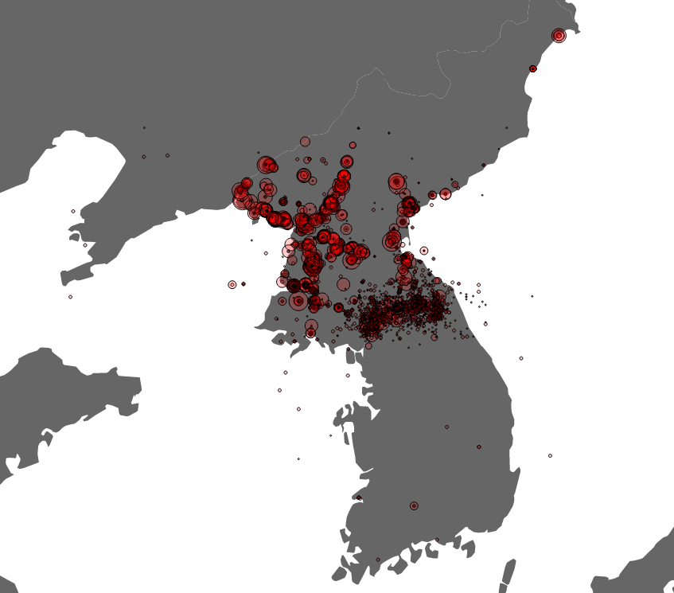

# Korean War Bombings
#### A map created using d3.js that shows the location of US bombings during the Korean War, using data from the [Theater History of Operations](https://data.world/datamil/korean-war-thor-data).





The code used to make this image is as follows:

```javascript
<!doctype html>
<html>

<head>
    <script src="https://d3js.org/d3.v3.js" charset='utf-8'></script>
</head>

<body class='hi'>
    <script>

        let w = 850
        let h = 750

        let svg = d3.select('body').append('svg').attr({ width: w, height: h })

        d3.json('k2.json', data => {
            let proj = d3.geo.mercator().center([-53, 40]).scale(3900).rotate([-180, 0])
            svg.append('g')
                .selectAll('path')
                .data(data.features)
                .enter()
                .append('path')
                .attr('fill', '#666666')
                .attr("d", d3.geo.path().projection(proj))

            d3.csv('THOR_Korean_Bombing_Operations_Exeter.csv', data => {

                svg.selectAll('circle')
                    .data(data)
                    .enter()
                    .append('circle')
                    .attr('r', d => {
                        return parseInt(Math.sqrt(d.CALCULATED_BOMBLOAD_LBS) * .02)
                    })
                    .attr('transform', d => {
                        return 'translate(' + proj([d.TGT_LONGITUDE_WGS84.slice(0, -1), d.TGT_LATITUDE_WGS84.slice(0, -1)]) + ')'
                    })
                    .attr('fill', 'red')
                    .attr('stroke', 'black')
                    .attr('fill-opacity', 0.2)
                    .append('svg:title')
                    .text(d => {
                        return d.TGT_LATITUDE_WGS84 + ', ' + d.TGT_LONGITUDE_WGS84
                    })
            })
        })


    </script>
</body>


</html>
```
